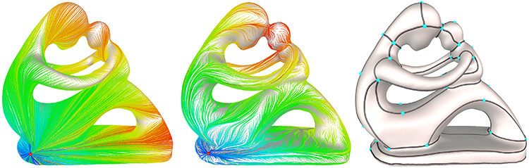
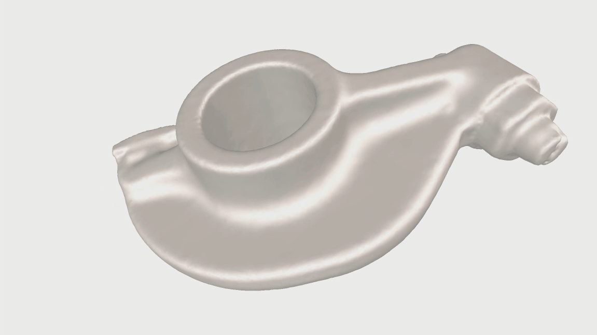
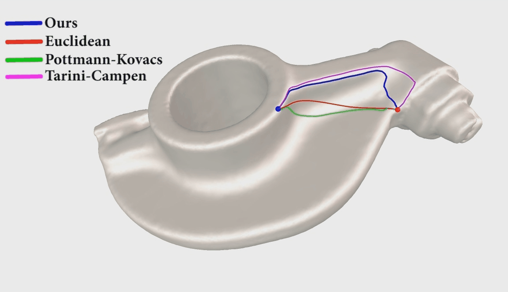

# LiveWire3D


This repository contains the source code for the paper [Anisotropic geodesics for live-wire mesh segmentation](http://yixina.net/projects/Livewire/Livewire_PG14.pdf). The tool is similar to 2d livewire, usually used for image segmentation. User simply puts pair of seed on the shape, and a feature sensitive shortest path connecting the seeds is generated in interactive time. By using this tool, the user can easily extract the layout of objects in seconds to minutes.

    


### Project Page

The project page is available at http://yixina.net/projects/Livewire/.


## Compile

### Clone the repo and install dependencies

This implementation uses [Qt5.12.2 vs2015_x64] [Visual C++ 2015 x64].
Other dependencies can be found in the folder ./libs/.

We use the source code of [Trimesh](http://graphics.stanford.edu/software/trimesh/) and [Geodesic](https://code.google.com/archive/p/geodesic/) in our project.

The compiled executable demo can be found [here](http://yixina.net/projects/Livewire/Livewire_demo.zip)

## Run Executable Demo
### Seeding and Tracing
 
Hold Shift + Mouse move to hightlight the seed under mouse cursor and trace the anisotropic geodesy connecting to the previous seed.
Hold Shift + Left-Mouse to use the current path.

### Comparison
 
Our anisotropic geodesy can trace long and feature sensitive path while maintaining the smoothness as euclidean geodesy.

### An example


### Citing this work

If you find this work useful in your research, please consider citing:
```
@article {AnisotropicGeodesic14,
title = {Anisotropic geodesics for live-wire mesh segmentation},
author = {Yixin Zhuang, Ming Zou, Nathan Carr, and Tao Ju}
journal = {Computer Graphics Forum, (Pacific Graphcis 2014)},
year = {2014},
volume = {33},
number = {7},
pages = {111-120}
}
```

## License

[MIT](https://github.com/ThibaultGROUEIX/AtlasNet/blob/master/license_MIT)
 
